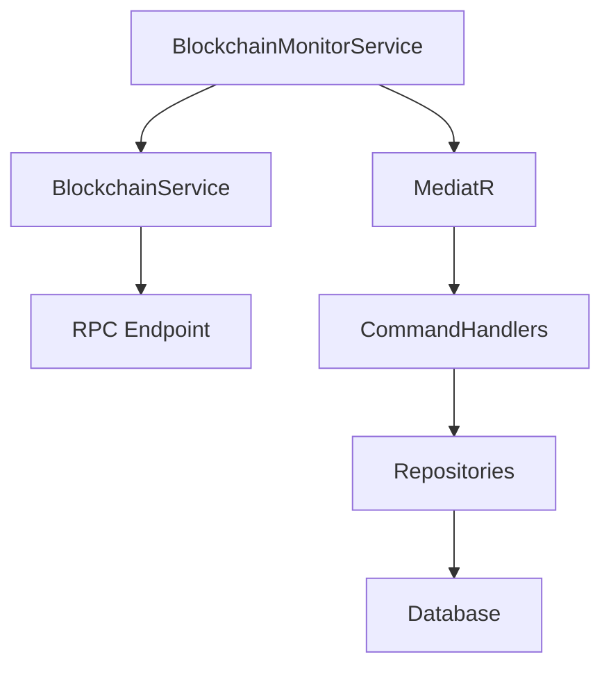

# Monitoring Guide

## Overview

The Blockchain Analyzer's monitoring system continuously tracks blockchain activity, focusing on:
- Block processing
- Contract detection
- Pool discovery
- Reserve updates

## Architecture

### Components



## Configuration

### Basic Settings

```json
{
  "Monitoring": {
    "PollingInterval": 120000,    // 2 minutes
    "BlocksToProcess": 5,         // Blocks per iteration
    "BatchSize": 1,              // Blocks per RPC call
    "RetryDelay": 30000,         // 30 seconds
    "MaxRetries": 5,             // Maximum retry attempts
    "RequestDelay": 10000        // 10 seconds between requests
  }
}
```

### Performance Tuning

#### High Throughput Settings
```json
{
  "Monitoring": {
    "PollingInterval": 60000,     // 1 minute
    "BlocksToProcess": 10,        // More blocks
    "BatchSize": 2,              // Larger batches
    "RequestDelay": 5000         // Faster requests
  }
}
```

#### Conservative Settings
```json
{
  "Monitoring": {
    "PollingInterval": 300000,    // 5 minutes
    "BlocksToProcess": 3,         // Fewer blocks
    "BatchSize": 1,              // Single block
    "RequestDelay": 20000        // Slower requests
  }
}
```

## Metrics & Monitoring

### Key Metrics

1. **Block Processing**
   - Blocks processed per minute
   - Processing latency
   - Failed block processing attempts

2. **Contract Detection**
   - New contracts discovered
   - Contract verification rate
   - Contract type distribution

3. **Pool Tracking**
   - New pools discovered
   - Reserve update frequency
   - Token pair statistics

4. **System Health**
   - CPU usage
   - Memory consumption
   - Database size
   - RPC request rate

### Logging

#### Log Levels
```json
{
  "Logging": {
    "LogLevel": {
      "Default": "Information",
      "AnalyzerCore.Infrastructure.BackgroundServices": "Debug",
      "AnalyzerCore.Infrastructure.Blockchain": "Debug",
      "Microsoft.EntityFrameworkCore": "Warning"
    }
  }
}
```

#### Sample Log Messages

```plaintext
[INF] Starting blockchain monitor for chain Ethereum
[DBG] Processing blocks 21790160 to 21790165
[INF] Found new pool: 0x... (TOKEN0/TOKEN1)
[WRN] Rate limit reached, backing off for 30s
[ERR] Failed to process block 21790163, retrying...
```

## Troubleshooting

### Common Issues

1. **High RPC Rate Limiting**
   ```plaintext
   Symptom: Frequent 429 Too Many Requests
   Solution: Increase RequestDelay and reduce BatchSize
   ```

2. **Memory Usage Spikes**
   ```plaintext
   Symptom: High memory consumption
   Solution: Reduce BlocksToProcess and enable garbage collection
   ```

3. **Database Contention**
   ```plaintext
   Symptom: Database locks or timeouts
   Solution: Implement retry logic and optimize queries
   ```

### Diagnostic Commands

```bash
# View recent logs
tail -f logs/analyzer.log | grep -i error

# Check process status
ps aux | grep AnalyzerCore

# Monitor memory usage
watch -n 1 "ps -o pid,ppid,%cpu,%mem,cmd -p $(pgrep -f AnalyzerCore)"
```

## Health Checks

### Endpoint Status
```http
GET /health
```

Response:
```json
{
  "status": "healthy",
  "components": {
    "blockchain": {
      "status": "healthy",
      "latency": 150
    },
    "database": {
      "status": "healthy",
      "connections": 5
    },
    "monitoring": {
      "status": "healthy",
      "lastBlock": 21790165
    }
  }
}
```

### Performance Metrics
```http
GET /metrics
```

Response:
```json
{
  "blockProcessing": {
    "blocksPerMinute": 15,
    "averageLatency": 200,
    "failureRate": 0.01
  },
  "rpcStats": {
    "requestsPerMinute": 30,
    "averageResponseTime": 150,
    "errorRate": 0.02
  },
  "system": {
    "cpuUsage": 45,
    "memoryUsage": 512,
    "uptime": 86400
  }
}
```

## Alerting

### Alert Conditions

1. **Block Processing Delays**
   ```json
   {
     "condition": "blockDelay > 100",
     "severity": "warning",
     "action": "notify"
   }
   ```

2. **High Error Rates**
   ```json
   {
     "condition": "errorRate > 0.05",
     "severity": "critical",
     "action": "page"
   }
   ```

3. **Resource Usage**
   ```json
   {
     "condition": "memoryUsage > 80%",
     "severity": "warning",
     "action": "notify"
   }
   ```

### Alert Channels

- Email notifications
- Slack integration
- PagerDuty
- SMS alerts

## Recovery Procedures

### Service Recovery

1. **Restart Service**
   ```bash
   systemctl restart analyzer-service
   ```

2. **Clear Cache**
   ```bash
   rm -rf /tmp/analyzer-cache/*
   ```

3. **Reset State**
   ```bash
   curl -X POST http://localhost:5000/api/v1/monitoring/reset
   ```

### Data Recovery

1. **Database Backup**
   ```bash
   sqlite3 local.db ".backup 'backup.db'"
   ```

2. **State Verification**
   ```bash
   curl -X POST http://localhost:5000/api/v1/monitoring/verify
   ```

3. **Resync Blocks**
   ```bash
   curl -X POST http://localhost:5000/api/v1/monitoring/resync \
     -H "Content-Type: application/json" \
     -d '{"fromBlock": 21790000}'
   ```

## Best Practices

1. **Rate Limiting**
   - Implement exponential backoff
   - Use multiple RPC providers
   - Cache frequently accessed data

2. **Resource Management**
   - Monitor memory usage
   - Implement circuit breakers
   - Use connection pooling

3. **Error Handling**
   - Log all errors with context
   - Implement retry policies
   - Monitor error rates

4. **Performance Optimization**
   - Batch RPC requests
   - Use efficient queries
   - Implement caching

## Maintenance

### Regular Tasks

1. **Daily**
   - Check error logs
   - Monitor resource usage
   - Verify block processing

2. **Weekly**
   - Analyze performance metrics
   - Review alert history
   - Backup database

3. **Monthly**
   - Clean old logs
   - Update configurations
   - Review performance trends